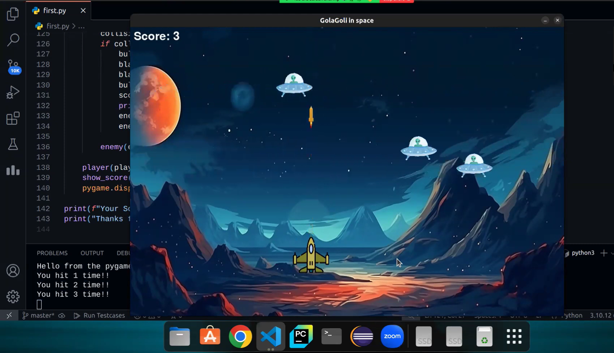

# ✈️ Pygame Project: Plane vs Alien

**Developer🙋‍♂️**: [Mehedi Hasan](https://github.com/mh-MeHeDii)

A basic plane war game vs Alien spaceship where user/gamer can destroy the opponents by firing missiles. 

---

## 📜 About the Project

This project recreates the timeless Fighting between plane vs UFOs, where players destroy the UFOs by firing bullets. It also display the score continuously in the running game window in order to track.

---

## 🎮 Features

- **Single-player gameplay**: Enjoy a classic offline game mode where you control a plane and firing.
- **Sound System**: There is a beautiful sound system while running game, firing, collision.
- **Score Display**: See the current score in game window.
- **Offline Play**: No internet connection required.

---

## 🖼️ Screenshots

### Gameplay


---

## 🛠️ Tools, Technologies, and Frameworks Used

- **Python Programming Language**: Handles core game logic and functionality.
- **Pygame Library**: Powers graphics and input handling.

---

## 🚀 How to Run the Game

1. **Install Pygame and Dependencies**: Ensure Python3, Pygame are installed on your system.
2. **Run Code**: Use the following code in terminal. For example:
   ```sh
   python3 first.py
